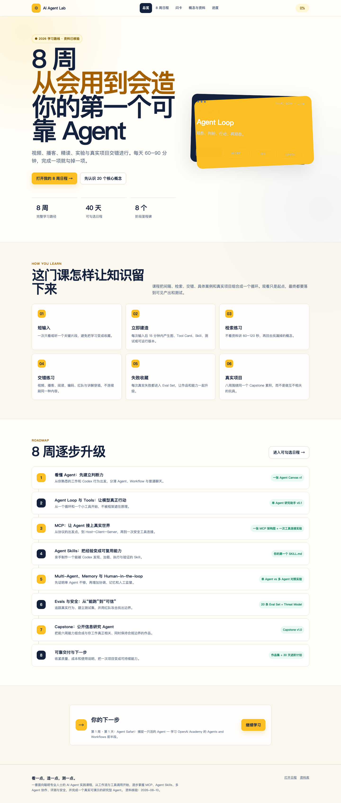

# AI Agent 学习实验室

一套中文、项目驱动的 AI Agent 互动课程。通过 8 周、40 天的日程，从 Agent 基础、Tools 和 MCP，逐步学习 Agent Skills、多 Agent、Evals、安全与完整 Capstone。



## 主要功能

- 160 项可逐项勾选的学习任务
- 视频、播客、官方阅读和实践项目
- 20 张核心概念闪卡、互动测验和错题优先复习
- 自动保存的日程、笔记、正确率和进度面板
- 日历导出、学习记录备份与恢复
- 可安装、可离线使用的 PWA
- Agent Canvas、Eval Set、评分表、Threat Model 和 Skill Starter

## 开始使用

### macOS

双击 `打开学习实验室.command`，课程会在浏览器中打开。日程、闪卡与进度页会稳定共享同一份本地学习记录。

### 其他系统

在项目目录启动任意静态文件服务器，然后访问 `index.html`。例如：

```bash
python3 -m http.server 4173
```

直接打开 `index.html` 可预览内容；由于浏览器对 `file://` 存储的处理不同，完整互动功能请使用上述启动入口。

所有学习进度只保存在当前浏览器中；建议定期在“进度”页导出备份。

## 浏览器回归测试

安装开发依赖后运行：

```bash
npm install
npm test
```

测试会自动启动和关闭独立的本地预览，不需要提前运行课程。若要检查已经部署的网站，可设置 `BASE_URL` 后运行同一命令。

## 隐私与内容边界

- 学习记录默认只保存在本机浏览器中。
- 示例要求使用公开信息或去标识化数据，不要输入患者信息、公司机密或客户隐私。
- 仓库只提供指向外部学习材料的链接；这些材料仍受各自作者和网站条款约束。

## 公开发布前

当前版本默认用于本地和离线学习，因此禁止搜索引擎索引，也没有填写虚构域名。公开部署时需要使用真实网址补充 canonical、Open Graph、`robots.txt` 和 `sitemap.xml`，然后再开放索引。

## 参与贡献

请阅读 [CONTRIBUTING.md](CONTRIBUTING.md)。安全问题请按 [SECURITY.md](SECURITY.md) 私下报告。

## License

本项目采用 [MIT License](LICENSE)。
